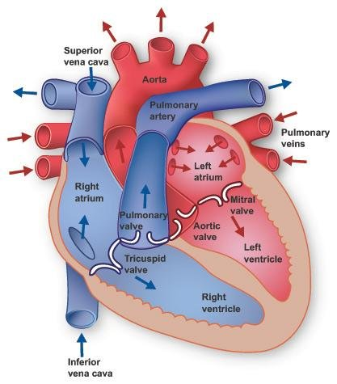

# First Aid

## Sections
* [Aide Memoire](am/aide_memoire.md)
* [Mental Health](mhfa/mental_health.md)
* [PHECC Links](phecc.md)

## General Links

### Definitions
* [First Aid](https://en.wikipedia.org/wiki/First_aid) 
* [OSCE](https://en.wikipedia.org/wiki/Objective_structured_clinical_examination)

### Heart 
* [Irish Heart Foundation](https://irishheart.ie/)
* [Communitty First Responders - Ireland](http://cfr.ie/)
* [American Heart Association](https://www.heart.org/) 
* [AHA Spotify Playlist](https://open.spotify.com/playlist/5cjRIHvGIq33ACs2ebfqWU?si=Hzv9dw2sQIu1gkF5v3VNkA&utm_source=native-share-menu)

### Red Cross Red cresent
* [International Red Cross](https://www.icrc.org/)
* [Irish Red Cross](https://www.redcross.ie/)
* [RCRC Magazine](http://www.redcross.int/) [Direct Link](https://www.rcrcmagazine.org/)
* [Wikipedia](https://en.wikipedia.org/wiki/International_Red_Cross_and_Red_Crescent_Movement) 

